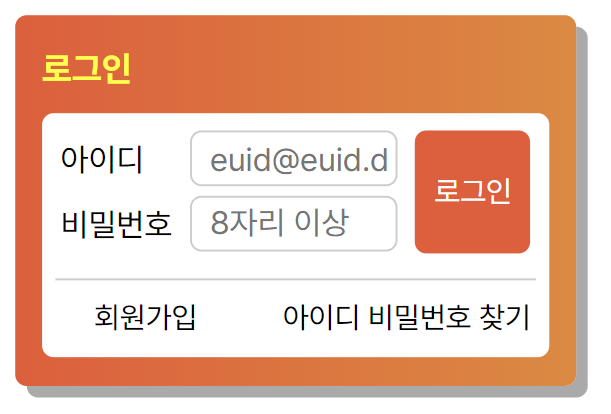

# Web Cafe 로그인 스타일 - S2  
 
## 로그인 마크업 & 스타일
**HTML 특징**
- 다양한 하위 요소를 포함할 수 있는 fieldset 요소를 적용하여 마크업
- label, input, button, li 요소를 활용  
<>
**CSS 특징**
  - 상단 로그인 영역 (*class="loginWrapper"*) : position(absolute) 속성 적용
  - 하단 로그인 링크 영역(*class="loginLink"*) : float 속성 적용  
  
  
## login.html 파일 설명
- 폼 요소를 전체 박스 모델로 설정  
  
1. 제목 (div 요소)
    - aria-label 속성값 지정하여 제목임을 명시  
  
2. 하위 박스 모델을 fieldset 요소로 생성하여, 내부에 다양한 하위 요소 배치가 가능하도록 한다.
    1. legend 요소: 상위요소로 제목을 지정해 주었기 때문에 숨김 처리  
  
    2. 상단 로그인 영역
        1. label과 input 요소를 적용한 로그인, 패스워드 영역 설정
            - 각 목적에 맞는 type 값을 설정하여 오류가 발생하지 않도록 한다.
            - required 속성을 통해 필수값 입력 요구
            - plabeholder 속성을 통해 예시 출력
            - 패스워드는 minlength 값을 설정하여, 최소 문자열 길이를 만족할 경우 버튼을 통해 제출 가능하도록 한다.  
  
        2. button 요소를 적용한 로그인 버튼    
  
    3. 하단 로그인 링크 영역
        - ul>li 요소를 적용하여 회원가입, 아이디 비밀번호 찾기 아이콘 배치
       - 하위에 a 요소를 작성하여 아이콘에 해당하는 링크 생성  
  
  
## login.css 파일 설명
1. 기본 설정: 요소 숨김 처리, 글씨 공통 설정  
  
2. 박스 모델 속성 설정 : 요소 크기, 여백, 테두리, 그림자, 배경, 글자 속성 등 설정  
  
3. 아이디, 비밀번호 input 및 버튼 배치
    - 로그인 상단 영역, 즉 상위 요소에 *position: relative;*
    - 하위 요소인 input, 버튼에 *position: absolute;* 적용하여 원하는 위치에 배치  

4. 로그인 링크 및 배치
    - ul 요소에 *list-style: none;* 적용하여 불릿 제거
    - 각 ul 요소에 *float* 속성을 적용하여 원하는 위치에 배치
        - padding과 margin 값을 추가 적용하여 위치 조절
    - 하위 a 요소에 *text-decoration: none;* 적용하여 텍스트 꾸밈 해제  
  
  
## 실행결과
