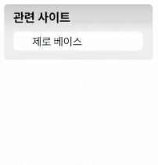

# Web Cafe 관련 사이트 목록 만들기 - s2   
   
## 관련 사이트 마크업 & 스타일
**HTML 특징**
- section 태그로 마크업
- nav, li, a 요소를 활용   
   
   
**CSS 특징**
- transition 속성을 활용한 애니메이션 효과  

---  
## transition.html 설명
- section 요소를 전체 박스 모델로 설정  
  
1. **제목** : 제목 콘텐츠로 제목 정의  

2. **링크 목록** : ul 요소 내부에 li 요소를 작성하여 링크 배치
    - **링크**
        - li 요소 내부에 a 태그를 작성하여 링크 연결
        - 목록 내 5가지 링크 영역이 서로 구분이 되어있지 않으므로, title 속성을 작성하여 사용자가 클릭할 부분이 어느 사이트로 이동하는지 알 수 있도록 함  
  
---
## transition.css 설명
1. **기본 설정** : 기본 속성 초기화, 글씨 설정  
  
2. **전체 속성 설정** : 테두리, 크기, 배경색, 여백 설정  
  
3. **링크 배치**
    - 링크 전체 목록
        - flex 속성을 설정하여 배치
        - overflow 속성을 설정하여 효과 적용시에만 전체 목록이 나타나게 함  
  
    - 링크 : a 요소의 display 속성을 block으로 설정하여 padding 값 적용
  
4. **애니메이션 효과**
    - 링크 목록에 transition 속성을 활용하여 애니메이션 효과 설정 - height, padding
    - 링크 목록에 가상 클래스 :hover을 이용하여 효과 적용  
  
---
## 실행결과
