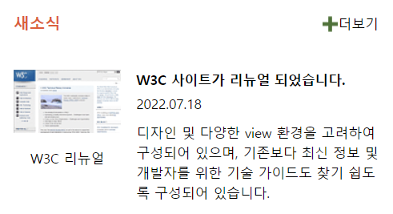

# grid를 활용한 새소식 공지 만들기 - S2  

## 새소식 공지 마크업 & 스타일  

**HTML 특징**
- article 태그로 마크업
- 제목 요소, section, time, img 태그 활용  
  
**CSS 특징**
- grid 속성을 활용한 배치  
   
---
## grid.html 설명
- newNotice 클래스를 가지는 article 요소를 전체 영역으로 설정  
  
1. **상단 영역**
    - **제목**: newTitle 클래스를 가지는 h3 요소
    - **더보기 아이콘**
        - add 클래스를 가지는 a 요소
        - 링크 연결을 위해 a 태그를 작성하였으며, 보안을 위해 'noreferrer noopener' 속성 적용 
  
2. **하단 영역**
    1. **새소식 내용 영역**: renewContent 클래스를 가지는 section 요소
        - 소제목: W3C__title 클래스를 가지는 h4 요소
        - 날짜: W3C__day 클래스를 가지는 time 요소
        - 본문: W3C__text 클래스를 가지는 div 요소  
  
    2. **이미지 영역**
        - 이미지: W3C__img 클래스를 가지는 img 요소
        - 이미지 설명: W3C__imgtext 클래스를 가지는 div 요소  
  
---
## grid.css 설명 (*class*)
1. **기본 설정**: 제목과 a 요소 초기화, 공통 글씨 설정, 여백 설정  
  
2. **grid**
    - **새소식 전체 영역** (*newNotice*)
        - display 속성의 grid 값을 사용하여 그리드 규정
        - gap과 grid-template-areas 속성을 사용하여 배치  
        
    - **상단, 하단 영역**
        - grid-area 속성을 활용하여 배치
        - 단, 새소식 내용(*renewContent*)영역은 section 요소로 묶어 한 단위로 배치
        (내부에 여백 설정)
        - 글자 배치가 추가로 필요한 더보기(*add*), 이미지 설명(*W3C__imgtext*) 영역의 경우 justify-self 속성 사용  
  
---  
## 실행결과

