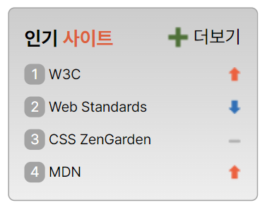

# 인기 사이트 만들기 - S2  
  
## 마크업 & 스타일링
**HTML 특징**
- section 태그로 마크업
- 제목 요소, ol, li 및 a 태그를 사용한다.
- a 태그에는 title 속성을 주어 이동하려는 사이트를 알 수 있도록 한다.  
    
**CSS 특징**
- display 속성의 grid를 적용한 배치
- 인기 사이트의 순위는 가상 요소 선택자 ::before을 사용한다.
- 인기 사이트의 변동을 나타내는 이미지는 background 속성으로 적용한다.  
  
---
## sprite.html
- 전체 영역 : section 요소 
  
    1. 제목
    - h2 태그 사용
    - 강조할 부분은 span 태그를 사용한다.
    ---
    2. 인기 사이트 목록
    - ol 태그 하위에 li 태그를 사용한다.
    - li 요소에 sprite와 spriteUp / spriteEqual / spritedown 클래스를 동시에 작성하여 해당하는 영역의 이미지가 보일 수 있도록 한다.
    - li 요소의 하위요소로 링크를 연결하는 a 태그를 사용하여 이동 가능하도록 한다.
    - a 태그에는 보안을 위해 'noopener noreferrer' 속성을 적용한다.
    ---
    3. 더보기 영역
    - a 태그를 사용하여 연결된 링크 사이트로 이동 가능하도록 한다.  
  
---
## sprite.css
1. 공통 설정 : 글씨, 초기화  
  
2. 배치 및 꾸미기 속성 설정
    1. 인기사이트 전체 영역 (*class: favorite*)
        - display 속성의 grid를 설정하여 제목, 목록, 더보기 영역 배치
        - 더보기 '+' 아이콘은 background 속성의 url 값을 주어 삽입한다.
        ---
    2. 목록 영역 (*class: facorite__list*)
        - display 속성의 grid와 gap 속성을 설정하여 목록 배치
        ---
    3. 순위 (*class: favorite__item*)
        - counter-increment 속성과 counter 함수를 사용하여 순차적으로 배치
        - 가상 요소 선택자 ::before를 활용하여 배치
        ---
    4. 링크 (*favorite__link*)
        - display 속성 inline-block과 width 속성으로 넓이를 조정
        - 화살표 영역을 제외한 부분에는 링크가 연결되도록 한다.
        ---
    5. 순위 아이콘 (*sprite spriteUp spriteEqual spriteDown*)
        - *sprite* 클래스에 background 속성의 url 값을 주어 이미지 삽입
        - no-repeat 값을 주어 반복되지 않도록 설정한다.
        - right 값을 주어 오른쪽으로 배치되도록 한다.
        - *spriteUp spriteEqual spriteDown* 클래스에 background-position-y 속성값을 각각 주어 해당하는 이미지가 출력되도록 한다.  
  
---
## 실행결과

